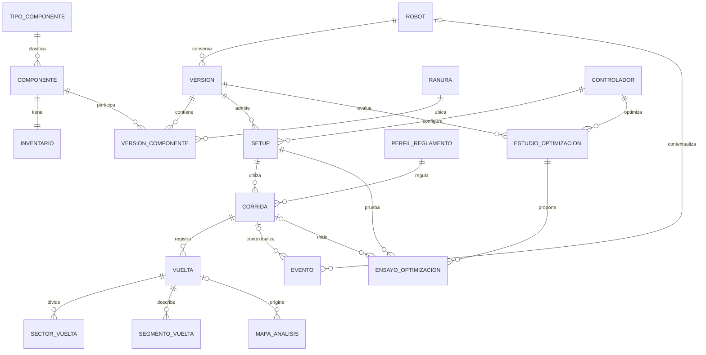

# DO-03 · Modelo de datos

Versión 1.0 · 6 de octubre de 2026 · Diseño para revisión.

Este documento define el modelo del sistema a partir de la consola que está en el repositorio. Incluye catálogo, inventario, armado, control, corridas, vueltas, eventos y los datos de análisis del prototipo. El motor previsto sigue siendo PostgreSQL 16.

**Estado de implementación:** migraciones `0001_base` a `0005_operaciones`, con catálogo/inventario, robots/versiones/piezas, controladores, perfiles, setups y resultados de corridas/vueltas. Las 32 operaciones REST de EN-01 están implementadas y probadas. Las semillas conservan registros existentes e incluyen Velocista 001 con v0/v1, 3 controladores y 4 perfiles. La demo opcional carga una corrida simulada. La integración de la consola con estas rutas y la adquisición automática de corridas físicas siguen pendientes. Aplicar migraciones con `alembic upgrade head`; agregar código no cambia una base ya existente.

## Entregables y fuentes

- [Diagrama entidad-relación editable](modelo-er.mmd).
- [Diccionario de datos](diccionario.md), con claves, unidades, restricciones y responsables.
- [Cobertura de campos del prototipo](cobertura-prototipo.md).
- [Tipos de componente y capacidades declarativas](tipos-componentes.json).
- [Contrato REST EN-01](../api/README.md), con OpenAPI y ejemplos.

Las fuentes son `consola/src/types/dominio.ts`, `types/corridas.ts`, `datos/{tipos,catalogo,robots,controladores,reglamento}.ts`, `stores/ConsolaContext.tsx`, `logica/{dominio,simulador,ingeniero}.ts` y los formularios de Catálogo, Armador y Mapa. El contrato de dispositivos sigue siendo [EN-02](../contrato/README.md). No se usa el manifiesto simulado de `logica/dominio.ts` como reemplazo del manifiesto validado por la API.

## Relaciones principales

El diagrama completo agrega atributos y relaciones de pertenencia. Una corrida se vincula con una versión y con el setup efectivamente aplicado. En competencia representa un intento de una vuelta; en pruebas admite varias vueltas bajo el mismo setup. Cambiar el setup abre otra corrida.

## Decisiones de integridad e historial

1. **Identificadores.** Se conservan claves de catálogo/robots como `c05` y `v001`, tipos como `linea` y controladores como `pid`. Los nuevos IDs se asignan en el servidor, con unicidad en la base. Versiones, setups, corridas y vueltas usan enteros positivos. `v0`, `v1`… es una etiqueta única dentro de cada robot, no una clave global. Los IDs enteros expuestos a JavaScript se limitan a `2^53-1`.
2. **Versiones.** Al guardar se crea una versión completa con cantidades por ranura y una copia de las características de cada componente. Nunca se editan sus piezas después de guardarlas. Cambiar precio, masa o especificaciones del catálogo no cambia un armado histórico. Solo el estado puede pasar de Actual a Anterior dentro de la transacción que crea la siguiente versión.
3. **Versión seleccionada.** `robot.version_actual_id` referencia la última versión creada, incluso Concepto o Borrador, para reproducir `curVer()`. El estado Actual indica un armado operativo; no debe inferirse del puntero. Un robot recién registrado puede no tener versiones. Como máximo hay una versión con estado Actual por robot.
4. **Concurrencia.** Crear versión bloquea la fila del robot y compara `version_base_id` con el puntero actual. Genera el siguiente ordinal, toma las instantáneas, cambia el estado anterior si corresponde y mueve el puntero en una transacción. Si otro usuario guardó primero, responde 409. Actualizar inventario compara e incrementa `revision` atómicamente.
5. **Stock.** `stock` es el total de unidades del club. `en_robots` suma las cantidades de la última versión de cada robot no archivado, también Concepto/Borrador, como hace el prototipo. `disponible = stock - en_robots` puede ser negativo; `faltante = max(0, -disponible)`. Es una demanda de planificación, no una reserva física. Una versión histórica no vuelve a consumir stock. Un par de ruedas o encoders sigue contando como una unidad del catálogo.
6. **Bajas.** Componentes, robots y setups se archivan, conservando las claves foráneas. Los archivados no se ofrecen para nuevas selecciones. Un componente archivado sigue visible en inventario mientras tenga existencias o demanda. Las lecturas por ID siguen disponibles para el historial. No se elimina en cascada el historial de corridas, versiones o eventos.
7. **Setups.** Cada guardado crea un registro inmutable con versión del robot, controlador, valores y definición de parámetros usada al validarlo. El servicio verifica nombres, rangos, paso, `base <= max` y, cuando existe, `vmin <= base`. La disponibilidad al enviarlo al robot se comprueba además contra el manifiesto EN-02 conectado.
8. **Tres estados del setup.** El borrador de los controles vive en la consola; el registro guardado vive en PostgreSQL; el aplicado es el que el dispositivo confirma. `POST /setups` no envía ni guarda en flash. `POST /dispositivos/{d}/comandos` devuelve 202 al enviar; el ack llega por WebSocket. La acción del prototipo «guardar en memoria del robot» requiere una historia de firmware: EN-02 no define un comando independiente de persistencia en flash.
9. **Corridas reproducibles.** Al iniciar se fijan versión, setup aplicado, firmware, manifiesto si existe, perfil y reglas, fuente sim/robot, modo, línea, compensación y potencia de turbina. Se conservan instantáneas de esos datos. Solo la nota es editable después del cierre. La fuente simulada nunca se presenta como medición física.
10. **Tiempos.** El tiempo oficial de meta y el interno del robot se conservan por separado. Los mensajes EN-02 usan milisegundos; los DTO REST y el prototipo usan segundos. Una vuelta fallida tiene tiempo oficial `null`, duración transcurrida separada y motivo. Para competencia, `J = round(tiempo_s + 2 × IAE, 3)` o `120` si no termina, siguiendo `calcular_j`. En pruebas con varias vueltas, la corrida muestra la mejor vuelta terminada por J (desempate por número), o J=120 si ninguna termina; no suma intentos como si fueran una sola vuelta.
11. **Idempotencia de mensajes.** El diseño necesita una clave estable por vuelta para reconciliar meta, telemetría y `sync`. `vuelta.id` es el `id_vuelta` asignado por la API y comunicado en `cierre_vuelta`. Un reenvío actualiza/completa esa misma fila. El contador `seq` y `ts` del dispositivo no son claves globales: se reinician. Los resúmenes autónomos sin un ID previamente asignado requieren una identidad de sesión persistente en la siguiente extensión de EN-02; no deben asociarse por aproximación ni deduplicarse solo por `seq`.
12. **Módulos.** Catálogo posee tipos/componentes/inventario; Armador posee robots/versiones/ranuras; Optimización posee controladores/setups/estudios; Reglamento posee perfiles; Corridas posee vueltas, sectores, segmentos y mapas; Eventos posee eventos. Las claves foráneas cruzan módulos; los imports de Python siguen usando únicamente `service.py` o `puertos.py`, según DO-02.

## Capacidades por tipo

Cada tipo conserva `campos` y `capacidades` como JSONB declarativo validado; cada componente conserva sus valores en `especificaciones`. El archivo [tipos-componentes.json](tipos-componentes.json) contiene los 14 tipos y todos los campos de `TIPOS`. Los tipos sin aportes de telemetría usan `capacidades: []`.

| Tipo | Declaración | Resolución por versión |
| --- | --- | --- |
| Regleta (`linea`) | `canales_linea` toma `canales` | Suma canales × cantidad: dos QTR-8A producen 16 canales |
| Encoder (`enc`) | `pulsos_por_vuelta` toma `cpr` | Se conserva por encoder; no se suman CPR entre ruedas ni se presupone multiplicación por cuadratura |
| IMU (`imu`) | `ejes` toma `ejes` | MPU-6050: 6 ejes; el manifiesto define los canales que el firmware realmente expone |
| Turbina (`turb`) | `potencia_electrica_max_w = v × imax` y control `potencia_control_pct`, 0–100 % | Ejemplo del catálogo: 7.4 V × 3.5 A = 25.9 W estimados; no es potencia mecánica medida |
| Motor (`motor`) | PWM de −100 a 100 % | Un actuador por motor instalado |
| MCU (`mcu`) | `radio` | Describe la radio; «Ninguna» no habilita arranque inalámbrico |
| Batería (`bat`) | Límite nominal de `bateria_v` desde `vmax` | La medición actual llega por telemetría, no se toma del catálogo |

Las especificaciones siguen siendo opcionales, como el formulario. Un campo ausente produce capacidad **desconocida**, nunca cero inventado. La suma de canales y la compatibilidad no pueden declararse completas con datos faltantes. El servidor rechaza claves no declaradas y tipos de valor incorrectos; el consumo `especificaciones.i` de una regleta y `consumo_a` deben coincidir cuando ambos se informan.

## Implementación posterior

1. Conectar la consola mediante adaptadores DTO, manteniendo explícito su modo simulado.
2. Integrar el ciclo físico de corridas/vueltas con los mensajes EN-02, su reconciliación e idempotencia persistente. El gateway actual valida y redistribuye mensajes; no crea automáticamente resultados en PostgreSQL.
3. Implementar mapas, estudios/ensayos de optimización, autenticación y contexto extendido de eventos según sus historias; no forman parte de los 32 endpoints actuales.
4. Revisar en equipo los resultados y continuar la integración por PR. La guía de verificación está en [pruebas-crud.md](../api/pruebas-crud.md).
